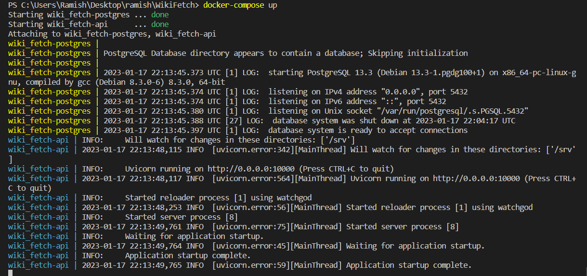
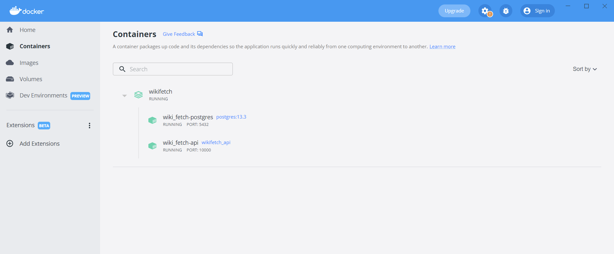
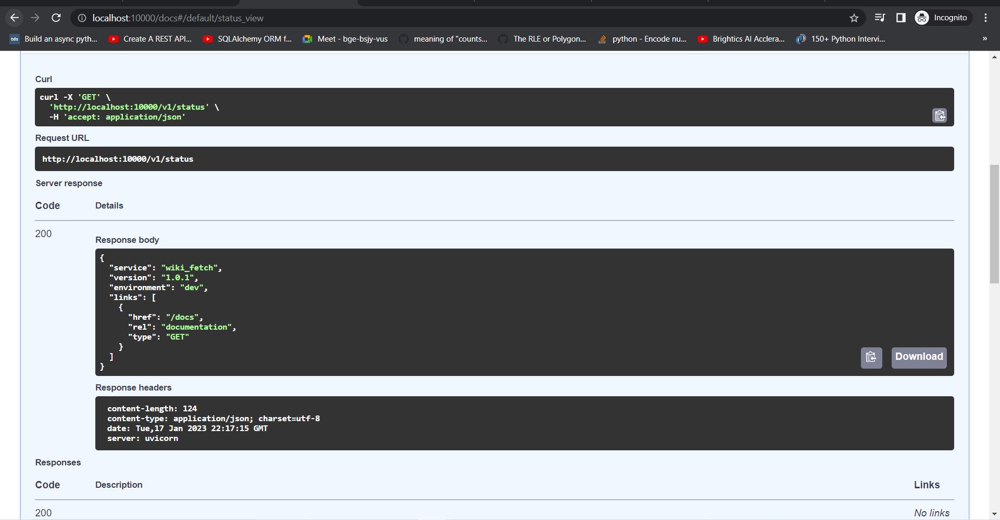
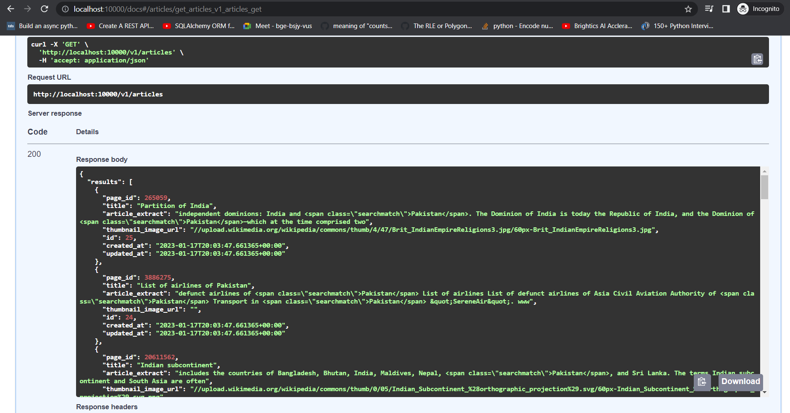

# WikiFetch

#### SQLAlchemy
SQLAlchemy is the Python SQL toolkit and Object Relational Mapper that gives application developers the full power and flexibility of SQL.

#### PostgreSQL
PostgreSQL is an object relational database management system which is a system used for managing data in relations, or tables which are grouped into databases, so you can have multiple tables in one database.

#### Docker
Docker is a platform for developers to develop, deploy, and run applications with containers since containers are portable, lightweight and stackable.

## Project Description
WikiFetch is a project to get articles from wikipedia, process that data and feed into an application.

## How to run the application
1. Clone the respository into your local system
> git clone https://github.com/RamishUrRehman007/WikiFetch.git
2. Run the following Docker Build commands to setup database and application
> docker-compose up -d postgres 
> docker-compose exec postgres sh -c '/mnt/migration.sh -d wiki_fetch_dev' 
> docker-compose up

3. Since everything is in Docker container, so let access to container and run article_main.py to get wikipedia articles.
> docker exec -it wiki_fetch-api bash 
> python .\wiki_fetch\articles_main.py

4. Run "http://localhost:10000/" on your browser to check if it is successful

5. Run "localhost/swagger" on your browser to interact with backend API to get all the articles stored in DB already.

6. Run "python -m unittest test_filter_articles.py" in same Docker Container to check the filter logic

